#  ml_regressions

### Experiments in linear, logistic, polynomial regression and regularization

To execute the project, simply
```
git clone
jupyter notebook Linear\ regression.ipynb
```
Documentation is provided in code comments

## Dataset 1.

A visualization of the data provided:

<p align="center">
  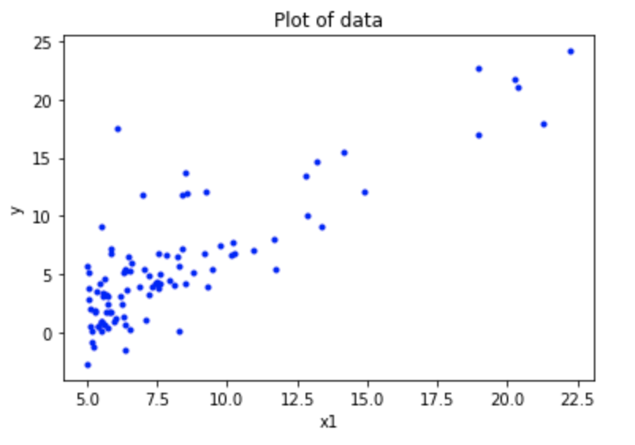
</p>

```
iterations = 100
learn_rate = 0.01
```
With the above parameters and using gradient descent of the MeanSquareError cost function. We obtained the following (log) cost curve. After running this descent algorithm we found the minima quickly. Resulting in the following output line.

<p align="center">
  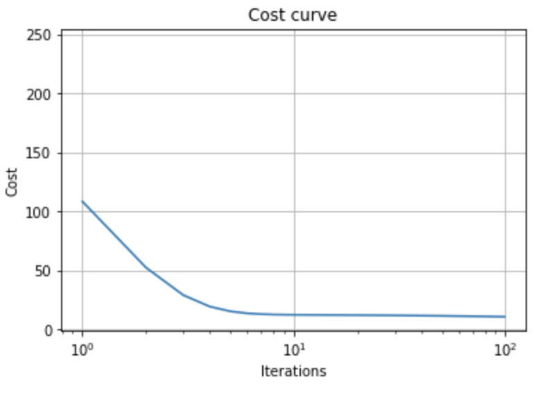
  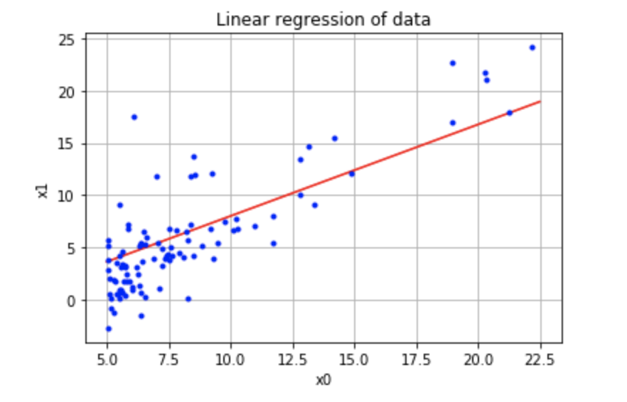
</p>

## Dataset 2.

A visualization of the data provided:

<p align="center">
  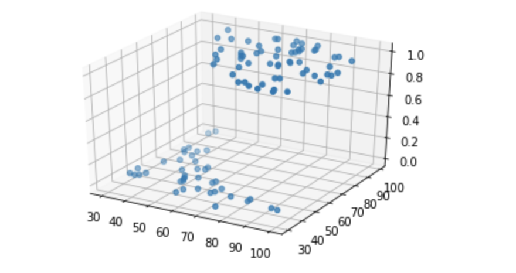
  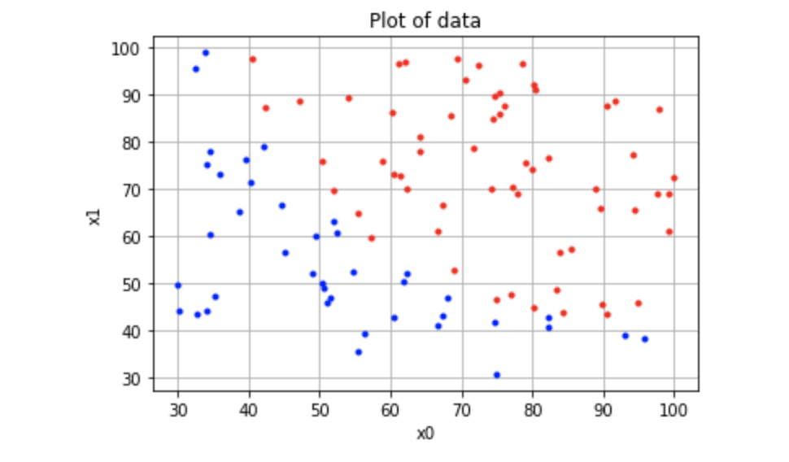
</p>

```
iterations = 500000
learn_rate = 0.0011
```
In this dataset, I applied a logistic linear model because the predictions to be generated should be discreet. The prediction is converted to probabilities through the sigmoid function.

<p align="center">
  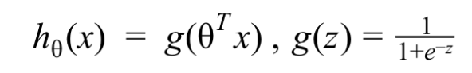
</p>
With the above hyper-parameters I ran the gradient descent algorithm and obtained the following cost curve and decision boundary

<p align="center">
  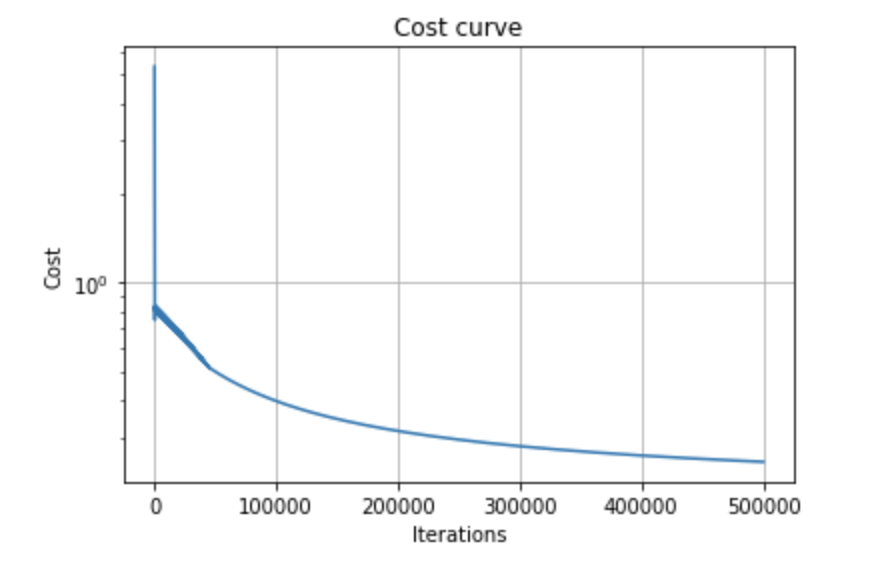
  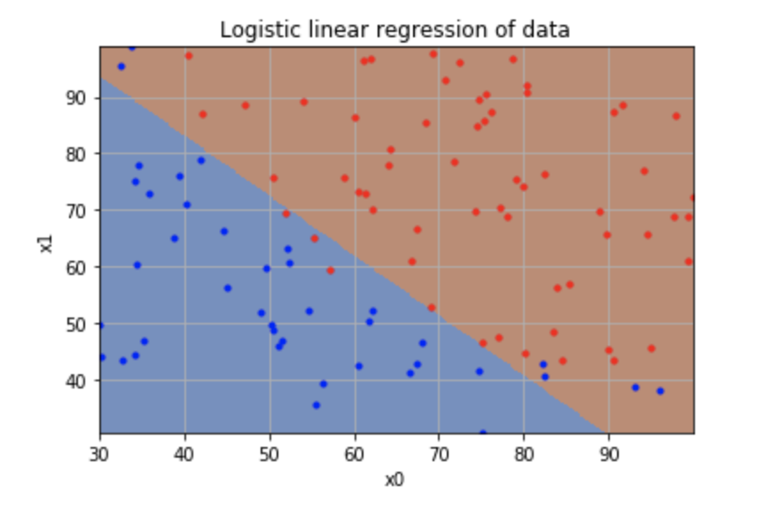
</p>

To improve on the previous prediction, I expanded the input feature-set to include polynomials up to 5 degrees. In addition, I also normalzied the input space by subtracting the mean and dividing by the standard deviation of the input. This, enabled us to have lower iterations and a higher training rate:

```
iterations = 50000
learn_rate = 0.1
```

<p align="center">
  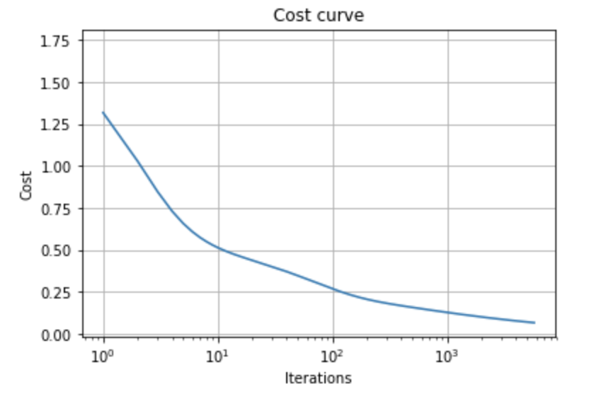
  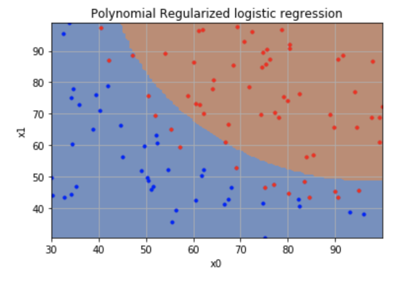
</p>

## Dataset 3.

A visialization of the data provided:

<p align="center">
  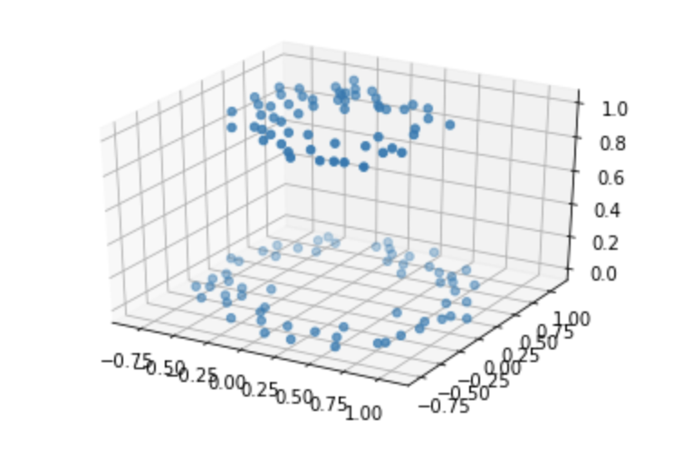
  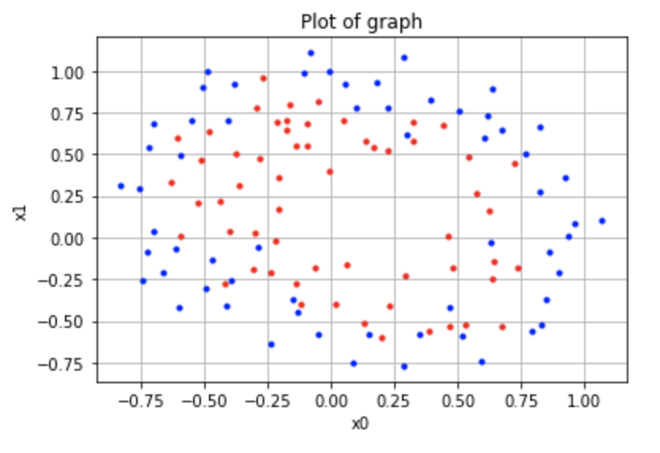
</p>

In the third dataset, I also used a polynomial logistic linear regression model due to the polynomial and discreet nature of the data.

```
poly_count = 10
iterations = 100000
learn_rate = 5
reg_lambda = 0
```

**Note:** The above hyper-parameters are higher than comparitive models on the same dataset because normalization was not applied in this case. By not normalizing, we used higher parameters to have similar results.

The results and cost curve:

<p align="center">
  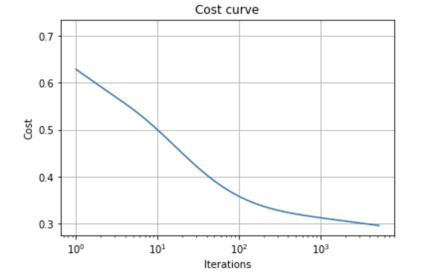
  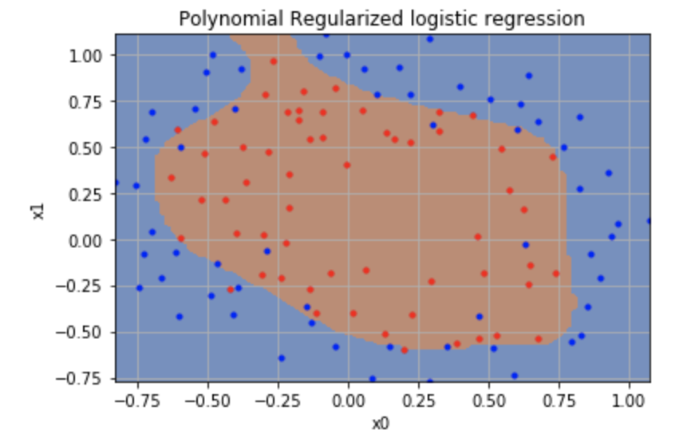
</p>

We observed that there was a lot of overfitting. So we introduced L2 regularization to our model. The following cross entropy cost equation was used.

<p align="center">
  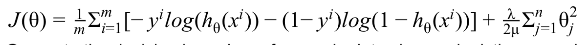
</p>

Regularization enables us to penalize large theta values which often enable the model to overfit. By regularizing, we force the model to use less theta values, and so more general feature selections.

```
poly_count = 10
iterations = 100000
learn_rate = 5
reg_lambda = 0.5
```

<p align="center">
  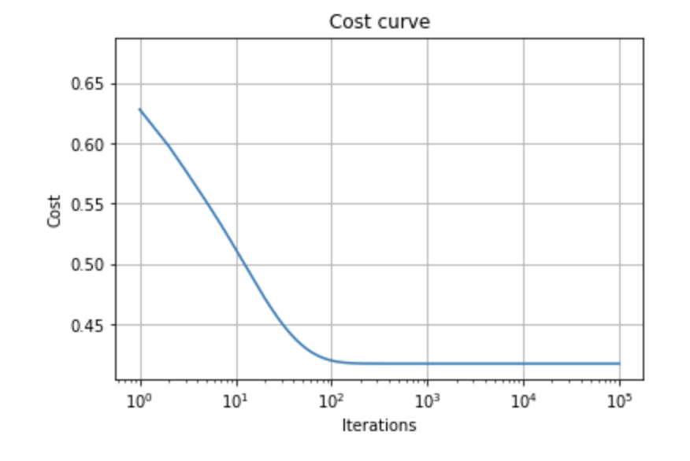
  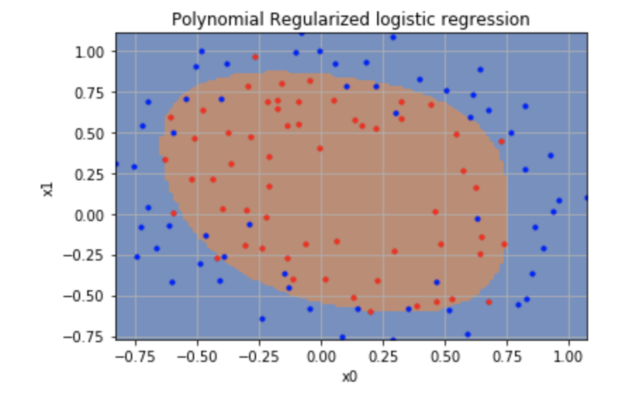
</p>
